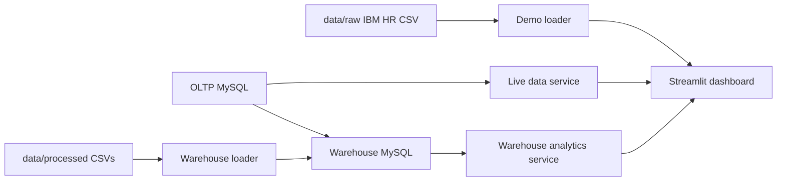

# HR Analytics Command Center

A data-driven HR analytics application built with Python, MySQL, Pandas, Plotly, and Streamlit. It combines employee operations with warehouse reporting in one dashboard: onboarding, projects, performance reviews, workforce KPIs, and attrition-risk signals.

The application is designed to work in two modes:

- **Live mode:** reads operational and warehouse data from MySQL.
- **Demo mode:** falls back to the bundled IBM HR CSV when MySQL is unavailable.

This makes the project easy to run locally while preserving a realistic OLTP-to-OLAP architecture for deployment.

## Features

- Executive overview with data-derived employee, project, review, and team counts.
- Department and year filters shared across the dashboard.
- Employee onboarding, project assignment, and review-tracking workflows.
- Warehouse performance trends, department rankings, and attrition-risk summaries.
- Synthetic historical employee data designed for SCD Type 2 modeling.
- MySQL schemas, ETL procedures, and analytics queries included in `sql/`.
- Modular frontend with reusable styling and page components.

## Quick Start

### Windows PowerShell

```powershell
python -m venv .venv
.\.venv\Scripts\Activate.ps1
python -m pip install -r requirements.txt
pytest -q
python -m streamlit run app.py
```

Open the local URL printed by Streamlit, usually `http://localhost:8501`.
If that port is occupied, choose another one:

```powershell
python -m streamlit run app.py --server.port 8505
```

### macOS or Linux

```bash
python3 -m venv .venv
source .venv/bin/activate
python -m pip install -r requirements.txt
pytest -q
python -m streamlit run app.py
```

## Configuration

Create a `.env` file in the project root when using MySQL. The database connection reads these variables:

```dotenv
MYSQL_HOST=localhost
MYSQL_PORT=3306
MYSQL_USER=your_user
MYSQL_PASSWORD=your_password
MYSQL_DATABASE=hr_analytics_oltp
```

Keep `.env` out of version control. Without a working MySQL connection, the dashboard automatically loads the bundled data in `data/raw/` and remains usable in demo mode.

## Data Sources and Flow



The dashboard does not use fixed banner totals. Team, project, and review counts are calculated from available processed files and fall back to loaded data when a processed file is unavailable.

## Project Layout

| Path | Responsibility |
| --- | --- |
| `app.py` | Streamlit configuration, data loading, navigation, and page routing |
| `frontend/ui.py` | Sidebar, hero, KPI cards, count formatting, and chart styling |
| `frontend/styles.py` | Shared dashboard CSS |
| `frontend/pages/` | Overview, onboarding, assignment, review, and warehouse views |
| `backend/data_service.py` | MySQL and CSV data access with fallback behavior |
| `backend/db_service.py` | Inserts for employee, project, and review workflows |
| `backend/analytics_service.py` | Analytics builder used by the warehouse page |
| `backend/kpi_service.py` | Executive KPI calculations |
| `src/hr_analytics/` | Domain entities, ETL, synthesis, database, and analytics logic |
| `data/raw/` | Original source data |
| `data/processed/` | Generated employee, project, assignment, and review files |
| `sql/` | OLTP schema, warehouse schema, ETL procedures, and reports |
| `tests/` | Unit tests for analytics, database helpers, and synthesis |

## MySQL Setup

Run the SQL scripts in this order using MySQL Workbench or the MySQL CLI:

1. `sql/01_oltp_schema.sql` creates the transactional schema.
2. `sql/02_olap_schema.sql` creates the reporting warehouse.
3. `sql/03_etl_stored_procedures.sql` creates warehouse transformation procedures.
4. `sql/04_analytics_queries.sql` provides reporting queries.

After processed CSV files are available, load them into the warehouse:

```powershell
python load_processed_to_warehouse.py
```

The warehouse analytics page expects performance facts joined to employee and date dimensions. If those warehouse tables are unavailable, the rest of the application still runs and the page reports that warehouse analytics are unavailable.

## Analytics Contract

Warehouse review rows use these columns:

`review_id`, `employee_id`, `department`, `review_date`, `performance_score`

The analytics service produces:

- `year`, `avg_score` for performance trends.
- `department`, `employee_id`, `performance_score`, `department_rank` for employee rankings.
- `department`, `risk_score` for attrition-risk visualization.

Keeping these contracts explicit prevents chart errors when raw warehouse rows and aggregated analytics results are used in different parts of the UI.

## Verification

Run the full test suite and a syntax check before sharing changes:

```powershell
pytest -q
python -m compileall app.py backend frontend src
```

## Further Documentation

- [Architecture](docs/architecture.md) explains the layers, ownership boundaries, and data contracts.
- [SQL scripts](sql/) contain the database and reporting implementation.
- [Tests](tests/) show the expected behavior of the core calculations and data helpers.
